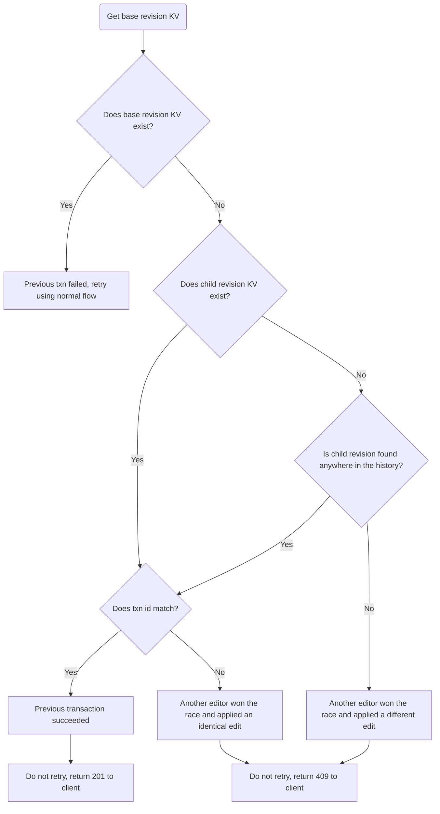
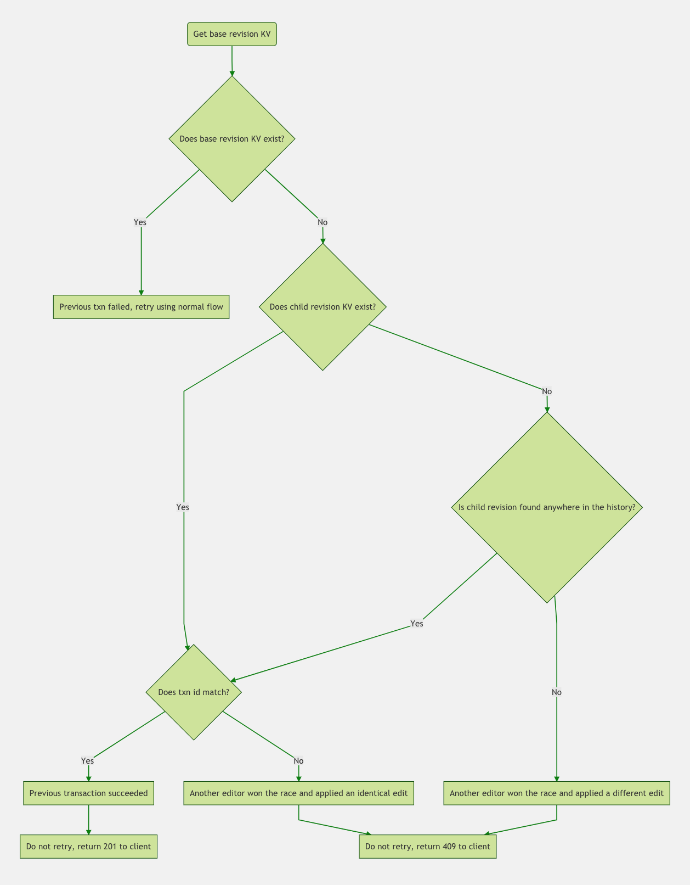
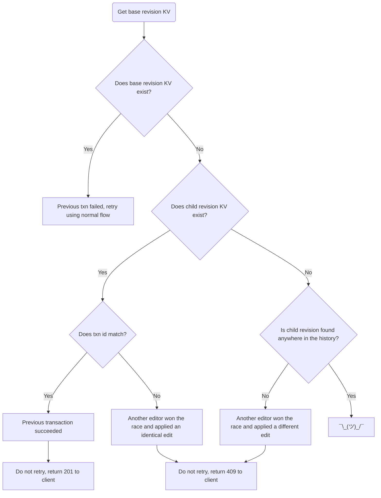
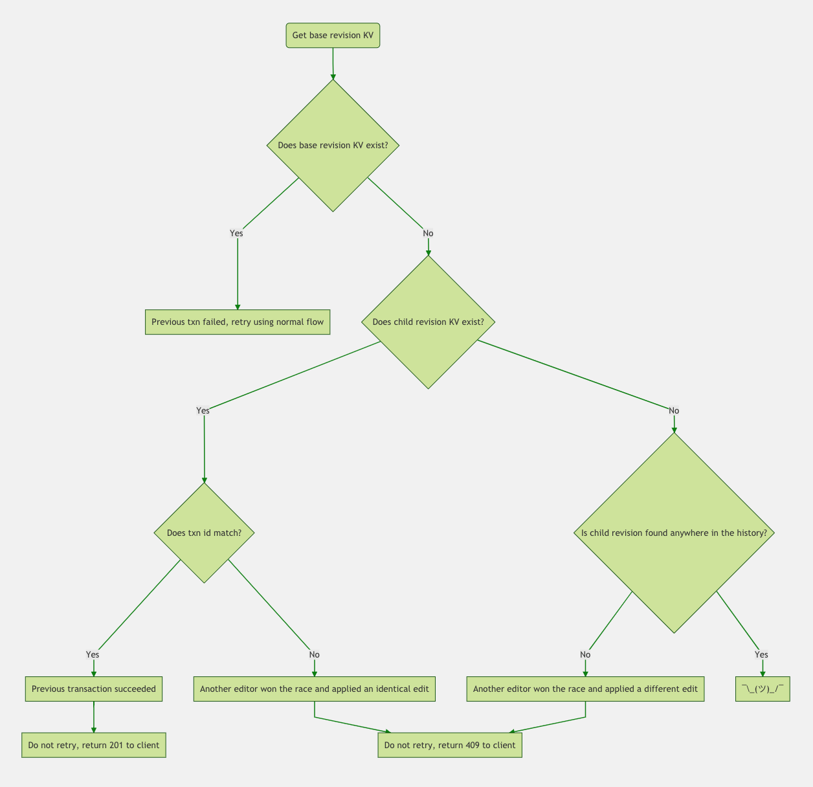
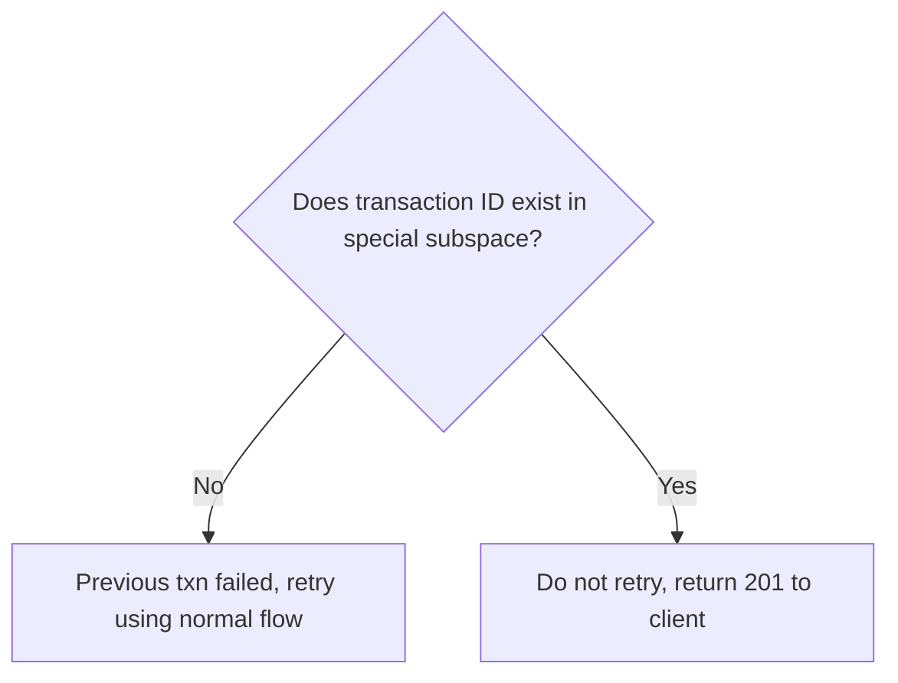
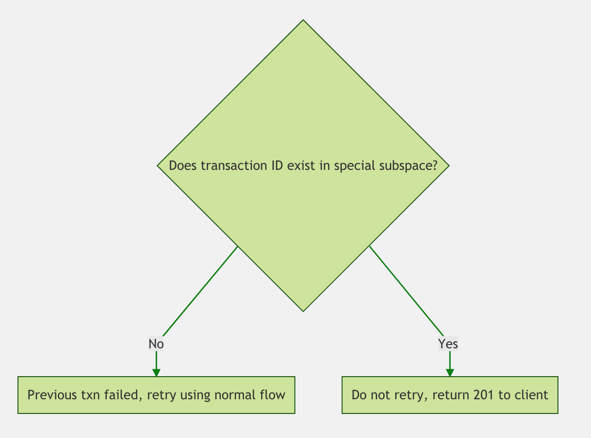

[NOTE]: # ( ^^ Provide a general summary of the RFC in the title above. ^^ )

# Introduction

Data Model and Index Management for `_changes` in FoundationDB

## Abstract

This document describes how to implement the `by_seq` index that supports the
`_changes` endpoints in FoundationDB. It covers the data model, index
maintenance, and access patterns.

The basic data model is one where the key is a `Sequence` (as defined below) and
the value is a document ID, revision, and branch count.

## Requirements Language

[NOTE]: # ( Do not alter the section below. Follow its instructions. )

The key words "MUST", "MUST NOT", "REQUIRED", "SHALL", "SHALL NOT",
"SHOULD", "SHOULD NOT", "RECOMMENDED",  "MAY", and "OPTIONAL" in this
document are to be interpreted as described in
[RFC 2119](https://www.rfc-editor.org/rfc/rfc2119.txt).

## Terminology

[TIP]:  # ( Provide a list of any unique terms or acronyms, and their definitions here.)

`Versionstamp`: a 12 byte, unique, monotonically (but not sequentially)
increasing value for each committed transaction. The first 8 bytes are the
committed version of the database. The next 2 bytes are monotonic in the
serialization order for transactions. The final 2 bytes are user-defined and can
be used to create multiple versionstamps in a single transaction.

`Incarnation`: a single byte, monotonically increasing value specified for each
CouchDB database. The `Incarnation` starts at `\x00` when a database is created
and is incremented by one whenever a database is relocated to a different
FoundationDB cluster.

`Sequence`: a 13 byte value formed by combining the current `Incarnation` of
the database and the `Versionstamp` of the transaction. Sequences are
monotonically increasing even when a database is relocated across FoundationDB
clusters.

`style=all_docs`: An optional query parameter to the `_changes` feed which requests that all leaf revision ids are included in the response. The replicator (one of the most frequent consumers of `_changes`) supplies this parameter.

---

# Detailed Description

The `_changes` feed provides a list of the documents in a given database, in order in which they were most recently updated. Each document shows up exactly once in a normal response to the `_changes` feed.

In CouchDB 2.x the database sequence is a composition of sequence numbers from individual database shards. In the API this sequence is encoded as a long Base64 string. The response to the `_changes` feed is not totally ordered; the only guarantee is that a client can resume the feed from a given sequence and be guaranteed not to miss any updates.

In a future release of CouchDB based on FoundationDB we will be able to offer stronger guarantees. The `Sequence` defined in the Terminology section above is totally ordered across the entire cluster, and repeated calls to `_changes` on a quiescent database will retrieve the same results in the same order. The `Sequence` will still be encoded as a string, but as it's a more compact 13 byte value we propose to encode it in hexademical notation (so a 26 character string). These strings will sort correctly, something that has not always been true in CouchDB 2.x.

## Data Model

Each database will contain a `changes` subspace with keys and values that take the form

`("changes", Sequence) = (SeqFormat, DocID, RevPosition, RevHash, BranchCount, NotDeleted)`

where the individual elements are defined as follows:

- `SeqFormat`: enum for the value encoding, to enable schema evolution
- `DocID`: the document ID
- `RevPosition`: positive integer encoded using standard tuple layer encoding
  (signed, variable-length, order-preserving)
- `RevHash`: 16 bytes uniquely identifying the winning revision of this document
- `Sequence`: the sequence of the last transaction that modified the document
  (NB: not necessarily the transaction that produced the `RevPosition-RevHash` edit).
- `BranchCount`: the number of edit branches associated with this document
- `NotDeleted`: `\x00` if the leaf of the edit branch is deleted, `\x01`
  otherwise

A typical response to `_changes` includes all of this information in each row except the internal `SeqFormat` and the `BranchCount`. The latter is used as an optimization for the `style=all_docs` request; if this parameter is specified and the `BranchCount` is 1 we can avoid making an extra request to the "revisions" space to discover that there are no other revisions to include.

## Index Maintenance

As discussed in [RFC 001]() (link TBD), an update attempt always retrieves the metadata KV for the current winning branch from the "revisions" subspace. This metadata entry includes the sequence of the last edit to the document, which serves as the key into the index in our "changes" subspace. The writer will use that information to clear the existing KV from the `_changes` subspace as part of the transaction.

The writer also knows in all cases what the `RevPosition`, `RevHash`, `BranchCount`, and `NotDeleted` will be following the edit, and can use the `set_versionstamped_key` API to write a new KV with the correct new sequence of the transaction into the "changes" subspace. Knowledge of `NotDeleted` is slightly subtle; it relies on the sorting of the Keys in the "revisions" subspace to ensure that if any live edit branch exists it will be the winner (and the system always reads the winning branch on any edit).

In short, the operations in this subspace are
- doc insert: 0 read, 0 clear, 1 insert
- doc update: 0 read, 1 clear, 1 insert

## Handling of Unkown Commit Results

When using versionstamped keys as proposed in this RFC one needs to pay particular care to the degraded mode when FoundationDB responds to a transaction commit with `commit_unknown_result`. Versionstamped keys are not idempotent, and so a naïve retry approach could result in duplicate entries in the "changes" subspace. The index maintenance in this subspace is "blind" (i.e. no reads in this subspace are performed), and so this would seem to be a valid concern; fortunately, the transaction that updates the "changes" subpsace will also update the "revisions" subspace with a specific KV corresponding to this document update.

### Option 1: Transaction IDs with Every Revision

When retrying a transaction with an unknown result, the CouchDB layer will again try to read the base revision against which the update is being attempted. The logic flow looks like this:

The flow above refers to a "transaction ID"; this is an extension of the
revision metadata to uniquely identify each transaction attempt. A versionstamp
would work here, if the storage overhead is acceptable. Alternatively some
smaller number of random bytes could be used to provide a probabilistic
solution.

### Option 2: Store last transaction ID for each branch

Another compromise option would be to store the transaction ID only for the
latest edit to each branch, instead of for each of the last 1000 (by default)
edits. This would allow the layer to detect a concurrent attempt to apply an
identical edit, but would leave open the possibility that a transaction which
starts after the transaction with `commit_unknown_result`, but completes before
the retry, could leave us unable to determine the success of the previous
transaction. That flow would look like this:

Landing on the ¯\\_(ツ)_/¯ case would require all of the following:
- Txn A with `commit_unknown_result`
- Txn A succeeding, or racing with Txn B applying an identical edit
- Txn C starting after A/B , modifying the same edit branch, and committing before the retry of Txn A gets a read version

### Option 3: Store all transaction IDs, cleanup async

Rather than storing the transaction IDs with the revision IDs, one could write a
separate blind KV into a transaction ID space. After a successful transaction
commit, the CouchDB layer could delete the transaction ID asynchronously. For
example, each process could dump the transaction ID of a successful commit into
a local ets table, and a process could scan that table once every few seconds
and clear the associated entries from FDB in a single transaction. The flow for
this design in the case of `commit_unknown_result` is dramatically simpler:

Leaving this section available for comments and suggestions on how to proceed.

## Access Patterns

Let's consider first the simple case where an entire response to `_changes` fits within a single FoundationDB transaction (specifically the 5 second limit). In this case a normal request to `_changes` can be satisfied with a single range read from the "changes" subspace. A `style=all_docs` request will need to check the `BranchCount` for each row; if it's larger than 1, the client will need to do a followup range request against the "revisions" subspace to retrieve the additional revision identifiers to include in the response. A request with `include_docs=true` will need to make a separate range request to the doc storage subpsace to retrieve the body of each winning document revision.

[NOTE]: # ( Describe the solution being proposed in greater detail. )
[NOTE]: # ( Assume your audience has knowledge of, but not necessarily familiarity )
[NOTE]: # ( with, the CouchDB internals. Provide enough context so that the reader )
[NOTE]: # ( can make an informed decision about the proposal. )

[TIP]:  # ( Artwork may be attached to the submission and linked as necessary. )
[TIP]:  # ( ASCII artwork can also be included in code blocks, if desired. )

# Advantages and Disadvantages

[NOTE]: # ( Briefly, list the benefits and drawbacks that would be realized should )
[NOTE]: # ( the proposal be accepted for inclusion into Apache CouchDB. )

# Key Changes

[TIP]: # ( If the changes will affect how a user interacts with CouchDB, explain. )

## Applications and Modules affected

[NOTE]: # ( List the OTP applications or functional modules in CouchDB affected by the proposal. )

## HTTP API additions

[NOTE]: # ( Provide *exact* detail on each new API endpoint, including: )
[NOTE]: # (   HTTP methods [HEAD, GET, PUT, POST, DELETE, etc.] )
[NOTE]: # (   Synopsis of functionality )
[NOTE]: # (   Headers and parameters accepted )
[NOTE]: # (   JSON in [if a PUT or POST type] )
[NOTE]: # (   JSON out )
[NOTE]: # (   Valid status codes and their defintions )
[NOTE]: # (   A proposed Request and Response block )

## HTTP API deprecations

[NOTE]: # ( Provide *exact* detail on the API endpoints to be deprecated. )
[NOTE]: # ( If these endpoints are replaced by new endpoints, list those as well. )
[NOTE]: # ( State the proposed version in which the deprecation and removal will occur. )

# Security Considerations

[NOTE]: # ( Include any impact to the security of CouchDB here. )

# References

[TIP]:  # ( Include any references to CouchDB documentation, mailing list discussion, )
[TIP]:  # ( external standards or other links here. )

# Acknowledgements

[TIP]:  # ( Who helped you write this RFC? )