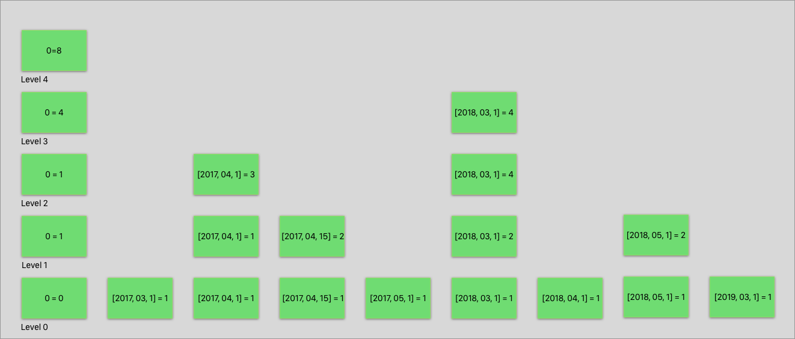

## Introduction

This document describes 3 possible ways to support CouchDB's reduce functionality on top of FoundationDB.
The main focus will be on a Skip List algorithm as it has the most potential to support all the required functionality.

## Abstract

Reduce indexes allow users of CouchDB to perform aggregations on a map index. These aggregations need to be stored in FoundationDB in a way that is efficient for updating the index on document updates and when retrieving results for different reduce group level's.
Three options are initially listed, with a skip list approach selected as the most viable option. A process flow for building, retrieving and updating a skip list based reduce index is described. Finally, the data model for using this with FoundationDB is shown.

## Requirements Language

The key words "MUST", "MUST NOT", "REQUIRED", "SHALL", "SHALL NOT",
"SHOULD", "SHOULD NOT", "RECOMMENDED",  "MAY", and "OPTIONAL" in this
document are to be interpreted as described in
[RFC 2119](https://www.rfc-editor.org/rfc/rfc2119.txt).

## Terminology

No new terminology at this point.

---

## Detailed Description

Reduce indexes allow users of CouchDB to perform aggregations based on the key/values emitted from the map function.
A lot of the power of the reduce functionality that CouchDB currently supports is because internally each map/reduce index is stored in a b+tree with non-leaf nodes containing aggregated results of the leaf nodes below them. Allowing for efficient retrieval of those values. It is difficult to replicate that behavior exactly using FoundationDB. Therefore to implement reduce indexes in FoundationDB three possible ways are considered.

### Option 1 - On the fly reduce calculation

The simplest implementation is to perform the reduce function on the fly when a reduce query is requested.
The map index will be read and the reduce aggregation performed on the keys as they are fetched from FoundationDB.
This is by far the easiest to implement, but query performance will degrade as the database and index grows and could reach a point where the reduce query just stops working.

### Option 2 - Precompute of all group-levels

Another option is to precompute all group level's for a reduce function and store them as key/values in FoundationDB.
This makes querying fast as the results are already calculated. The first difficulty comes when updating the index.
For the built-in `_sum` and `_count` reduce functions, a single reduce calculation can be run and then applied to all group levels.
For any custom reduce functions along with  `_stats` and `_approx_count_distinct`, the updating of each group level would be more complex as it requires reading all keys and running them through the reduce functions for all group levels before storing it back in FoundationDB.

Another issue is any queries using startkey/endkey can be an expensive operations as we would have to perform aggregations on the startkey and the endkey key ranges. Then `group_level = 0` queries with a startkey or endkey would require a full aggregation of the keys in that range which again could be an expensive operation.

### Option 3 - Skip list implementation

The final option is using a skip list. A skip list can be thought of as a layered linked list. The bottom layer contains all the elements in an index. Each layer up from that is has a reduced (pun intended) number of elements in that list. See figure 1 for a simple skip list layout.


*Figure 1:* Example of a skip list

A skip list would make it easier to query an index using startkey/endkey and more efficient than option 2 to update an index for all types of reduce functions.

### Skip list implementation

This section does a deep dive into how a skip list can be used to create, query and update a reduce index.
To explore these situations, we will have the following design document defined.

```js
    {
        "_id": "_design/reduce-example"
        "views: {
            "example": {
                "map": function (doc) {
                    emit([doc.year, doc.month, doc.day], 1);
                },

                "reduce": "_count"
            }
        }
    }

```

And it emits the following key/value results for the reduce function:

```js
    [2017, 03, 1] = 1
    [2017, 04, 1] = 1
    [2017, 04, 15] = 1
    [2017, 05, 1] = 1

    [2018, 03, 1] = 1
    [2018, 04, 1] = 1
    [2018, 05, 1] = 1

    [2019, 03, 1] = 1
    [2018, 04, 1] = 1
    [2018, 05, 1] = 1
```

#### Create

To build the skip list, all keys will be added to level 0. Then each level up, a reduced number of keys will be added. For each level above 0, if a key/value is not added to that level, then that key's value is aggregated with the previous node in that row. Therefore each key/value node in a level is an aggregation of its key/value in level 0 and any key/values from the previous level that are greater than the node and smaller than the next node on that level. 

See figure 2 for an example of the listed keys added to a skip list.


*figure 2:* The emitted reduce keys added to a reduce skip lis

The optimal number of levels and the correct distribution algorithm is unknown at this stage, these settings will be configurable so that we can test and determine the best fit.

#### Query

From the above figure 2, we can see that for a reduce query with `group = true` then level 0 will be used to return all the exact keys.
And for a query with `group_level = 0` then the highest level can be used. 
If a `group_level > 1` is set for a reduce query, we need to traverse the skip list and aggregate the results before returning the results to the user.

For example, using figure 2, with a reduce query of `group_level = 2`. We start at Level 4, we would traverse down to level 3, compare Node 0 and Node [2018, 03, 1]. They are not the same key for `group_level = 2` so we need to move to a lower level. We would perform the same action of comparing the current node with the next node to see if they are the same key until we find matching nodes or we get to level 0. In this case, we would reach level 0 and return Node [2017, 03, 1]. At Node [2017, 04, 1] it is possible to go back up to level 2 where we can compare [2017, 04, 1] and [2017, 04, 15]. Given they are the same, we can continue on level 1 and collect all the [2017, 04, x] keys. Once we have collected all of those. Those keys are run through a re-reduce before being returned. This process of comparing the current node with the next node would continue onwards. Each time comparing the current node with the next node. If they are the same, compare the Nodes at the next Level above until we reach a level where the keys are not equal. At that point, we would use the node values at the level just below that to move across, collecting all the equal keys to be run through a reducer before being returned.


*Figure 3:* Traversing flow to return results for `group_level = 2`

A query with startkey/endkey would follow a similar process.  Start at the highest level traversing across until we exceed the startkey, then move down until we find the startkey or nearest node to it. Then follow the above process of traversing the skip list to return all results until we reach a node that is greater or equal to the endkey.

#### Update

To update the reduce index, we will use the same map id index that keeps track of what keys are associated with a document. When a document is deleted. The previous keys will be removed from level 0. If the reduce function is `_sum` or `_count`, an atomic update is then performed for all Node's above Level 0 that would have included the values for the keys deleted.  

For reduce functions where we cannot perform an atomic update. The process for each level, above level 0, is to fetch all the key/values in the level below the current node that are used to calculate the current node's aggregation value. Re-reduce those keys to calculate the new value stored for the node and store those results back in FoundationDB.

When updating a document, the initial delete process is followed to remove the existing keys that are no longer emitted for this document. The new keys are added at level 0. For level's above 0, the same distribution algorithm will be used to determine if the key/values are added to a level. If they are, then an aggregation of the nodes after this node but at the level below is performed to calculate the aggregation value stored for this node. The previous node's value is also recalculated. This continues up to the max level on the skip list. For `_sum` and `_count` this can be done as an atomic update. For other reduce functions this will be a re-reduce. If the new key/value is not added to the level, the value is aggregated with a node smaller than the key in that level.

### Data model

The data model for the skip list implementation will follow the same design as map indexes where we store one row for the key and one row for the Value.

```erlang
{<database>, ?DB_VIEWS, Sig, ?VIEW_REDUCE_SK_RANGE, ViewId, SkipLevel, ReduceKey, RowType} = KeyValue | Value

SkipLevel = 0..?MAX_SKIP_LEVEL
RowType = ?KEY | ?VALUE

```

Each field is defined as:

- `<database>` is the specific database namespace
- `?DB_VIEWS` is views namespace.
- `Sig` is the design documents View Signature
- `?VIEW_REDUCE_SK_RANGE` is the reduce namespace
- `ViewId` id of a view defined in the design document
- `SkipLevel` is the skip level the key/value is being stored for
- `ReduceKey` is the encoded emitted keys
- `RowType` indicates if the row is storing the emitted key or emitted value

## Advantages and Disadvantages

- Skip Lists can be used for builtin reduces and custom reduces.

## Disadvantages

- Because the levels are randomly generated and values aggregated, there will be an increased number of traversals of lower levels compared to using a B+tree.

## Key Changes

Instead of using a B+tree to store reduce aggregations, CouchDB's reduce functionality will be built on top of FoundationDB using a skip list like algorithm.

## Applications and Modules affected

The module `couch_views` will be modified to support building and querying reduce indexes.

## HTTP API additions

The won't be any additions to the HTTP API.

## HTTP API deprecations

There are no HTTP API deprecations

## Security Considerations

None have been identified.

## References

[Wikipedia Skip List](https://en.wikipedia.org/wiki/Skip_list)
[Skip lists done right](http://ticki.github.io/blog/skip-lists-done-right/)
[FoundationDB Forum skip list suggestion](https://forums.foundationdb.org/t/couchdb-considering-rearchitecting-as-an-fdb-layer/1088/11)
[Initial mailing list discussion](https://lists.apache.org/thread.html/011caa9244b3378e7e137ea7b0f726d8e6a17009df738a81636cb273@%3Cdev.couchdb.apache.org%3E)

## Acknowledgements
